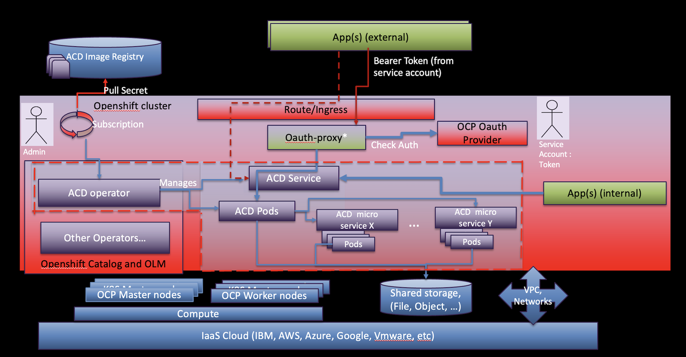

<!--                                                                    -->
<!-- (C) Copyright Merative US L.P. and others 2018, 2023                -->
<!--                                                                    -->
<!-- SPDX-License-Identifier: Apache-2.0                                -->
<!--                                                                    -->

## Annotator for Clinical Data (ACD) Container Edition

**PLEASE READ: The Merative Annotator for Clinical Data Container Edition is the replacement for the IBM Watson Annotator for Clinical Data Container Edition.  All Annotator for Clinical Data (ACD) Container Edition consumers need to migrate their ACD instances from IBM Watson ACD to Merative ACD by March 31, 2023.  Refer to the [Migration](/migration/considerations/) section for more details and instructions.**

## Details

This program is the container version of Annotator for Clinical Data (ACD).
The program allows a customer to run Annotator for Clinical Data on a cloud of their choice that supports Red Hat OpenShift.
This documentation discusses how to install Annotator for Clinical Data Container Edition on a Red Hat OpenShift cluster.

Annotator for Clinical Data is an AI-powered service that applies Natural Language Processing (NLP) engines to deliver meaningful insights from unstructured data, purpose-built for healthcare and life sciences domains. Annotator for Clinical Data uses clinical NLP trained models to extract key concepts from natural language text, such as conditions, medications, allergies, and procedures along with their associated medical codes (e.g. ICD-10, RxNorm, Snomed, LOINC). These features are enriched with deep contextual insights, along with values for key clinical attributes, in order to provide a more complete view of the data at hand. Potential data sources include a variety of healthcare and life sciences sources, such as clinical notes, discharge summaries, clinical trial protocols, and literature data.

This program supports English-only text for insight extraction.

[Try it Now](https://acd-try-it-out.mybluemix.net/preview)

## Features

### Clinical Insights

The [clinical insights](/clouddocs/clinical_insights_overview/) feature is a ready-to-use annotation capability within Annotator for Clinical Data that provides critical contextual information for problems, procedures, and medications identified in the text.

### Clinical Coding

Identify and code clinical concepts with support for SNOMED CT, RxNorm, ICD-10-PCS, CPT, NCI, MESH, and LOINC.

### Flexible Annotators

The medical domain NLP service features a variety of annotators for detecting metadata (such as entities, concepts, concept values, negated spans, hypothetical spans)
and a collection of annotators that detect, normalize, and code medical and social findings from unstructured clinical data. Multiple annotators can be employed
to analyze unstructured data from a single request.

## How it works

Annotator for Clinical Data is a REST API service that detects medical concepts within unstructured data.
When you send unstructured data to the service to be analyzed and designate the desired annotators to employ,
the service will route your unstructured data through the designated annotators and return the medical concepts detected within your unstructured data.

1. Designate which [available annotators](/usage/overview/#available-annotators) to employ in analyzing your unstructured data.
   This designation is defined as an annotator flow. See [Analyzing Text](/usage/analyze_text/) for more details.

2. Send your unstructured data along with the annotator flow to the service to extract the desired medical concepts.

3. The service will return a JSON response with extracted insights from the unstructured text analysis based on the requested annotator flow.

## Annotator for Clinical Data Container Edition Overview

The container edition of Annotator for Clinical Data is provided as a Kubernetes operator and set of container images that allow you to deploy, configure and manage Annotator for Clinical Data instances on your own Kubernetes cluster.  This documentation provides the [Planning](../../planning/namespace/) and  [Installation](../../installing/prereqs/) instructions to get started.

Annotator for Clinical Data consists of a top level "macro" or orchestration Annotator for Clinical Data service which provides the REST API endpoints and a set of local micro services that provide the analytics or annotators that are invoked with specific parameters and in a specified order during analyze calls.   These are provided as Kubernetes container images and the operator creates and manages the deployment of these.
The analytics of text is a stateless operation with nothing stored, however, configuration is stored in a local shared file system or object storage.
The following shows this setup with an optional security proxy that can be configured.

## Customizing Annotator for Clinical Data

Annotator for Clinical Data provides a set of predefined configurations you can install to use with your local ACD instance.  See [Using ACD](../../usage/getting-started/) for setup instructions after installing Annotator for Clinical Data.  See the [Customizing](../../usage/customizing/) documentation for information on customizing Annotator for Clinical Data.
