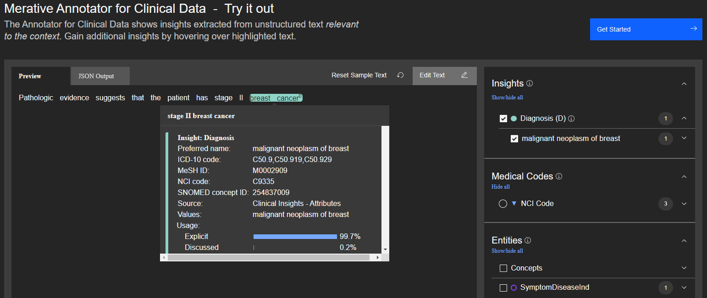

<!--                                                                    -->
<!-- (C) Copyright Merative US L.P. and others 2020, 2023               -->
<!--                                                                    -->
<!-- SPDX-License-Identifier: Apache-2.0                                -->
<!--                                                                    -->

<!-- # Clinical Insights Diagnosis Model -->

The diagnosis model provides usage information and other features about the diagnosis.



The demo application above shows an example of how to use the scores from the diagnosis model to create attributes.  In this example, stage II breast cancer has a high _explicit_ score and is promoted to an attribute.

The usage section of the JSON response indicates how a diagnosis applies to the patient.

## usage

| Feature | Description |
|:--------|-------------|
| explicitScore | The diagnosis applies to the patient. |
| patientReportedScore | The diagnosis is reported by the patient. |
| discussedScore | The diagnosis does not apply to the patient. |

## Other diagnosis features

| Feature | Description |
|:--------|-------------|
| suspectedScore | The diagnosis is probable, but not necessarily confirmed. |
| symptomScore | The diagnosis is a symptom versus a primary condition. |
| traumaScore | The diagnosis is a physical trauma. |
| familyHistoryScore | The diagnosis applies to a family member and not the patient. |

### Sample Response

Consider the following sample text.

Pathologic evidence suggests that the patient has stage II breast cancer

The clinical insights features for stage II breast cancer might look as follows:

```
"insightModelData": {
	"diagnosis": {
		"usage": {
			"explicitScore": 1,
			"patientReportedScore": 0,
			"discussedScore": 0
		},
		"suspectedScore": 0.517,
		"symptomScore": 0,
		"traumaScore": 0,
		"familyHistoryScore": 0
	}
}
```
