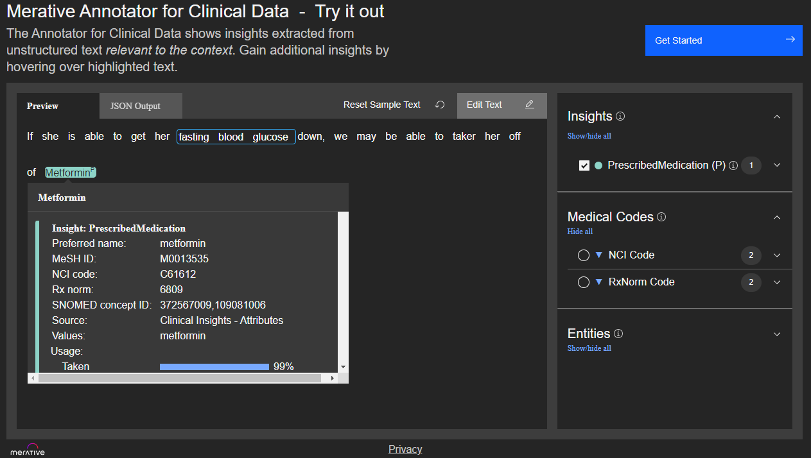

<!--                                                                    -->
<!-- (C) Copyright Merative US L.P. and others 2020, 2023               -->
<!--                                                                    -->
<!-- SPDX-License-Identifier: Apache-2.0                                -->
<!--                                                                    -->

<!-- # Clinical Insights Medication Model -->

The medication model provides information about how a medication annotation applies to the patient and about lifecycle events related to that medication.



The demo application above shows an example of how to use the scores from the medication model to create attributes.  In this example, Metformin has a high _taken_ score and is promoted to a PrescribedMedication attribute by the cartridge scoring rules.

The usage section of the JSON response indicates how a medication applies to a patient.

## usage

| Feature | Description |
|:--------|-------------|
| takenScore | Evidence that the given medication is currently being taken by the patient, has ever been taken by the patient, or there is a firm plan to put the patient on that medication. |
| consideringScore | Medication is being considered as an option for the patient. |
| discussedScore | Other mentions of the medication that do not directly apply to the patient (For example:  _She is not currently taking Warfarin_ or _We considered Warfarin but opted not to use it because of the risk of bleeding._). |
| labMeasurementScore | The medication mention is a lab measurement and does not directly indicate a medication the patient is taking. |

The medication model also provides information about lifecycle events - _start_, _stopped_, _dose changed_, and _adverse events_.

Each event has the following scores:

| Feature | Description |
|:--------|-------------|
| score | How strongly does the language around the candidate annotation look like it indicates the given lifecycle event. |
| usage | Describes the sense of the medication event. |

| Feature | Description |
|:--------|-------------|
| explicitScore | The event directly applies to the patient. |
| consideringScore | The event is something that may apply to the patient. |
| discussedScore | The event does not apply to the patient. |

Note that the lifecycle events only look at local context clues and do not try to reason across large distances in the text or multiple documents.  

* startedEvent - There is language that indicates a medication was started.
* stoppedEvent - There is language that a medication was stopped.
* doseChangedEvent - There is language that indicates the dosage of a medication was changed.
* adverseEvent - The medication mention is associated with any sort of bad outcome for the patient.  In addition to a _score_ and _usage_ section, adverseEvent also has an _allergyScore_ that indicates if the given AE is just an allergy mention.

You can use the usage scores to carve very specific boundaries around the kinds of medication mentions that you surface in your application.  For example, depending on your use case, you may want to know about when a dose change occurred, but not when it was just mentioned as a consideration.

## modifiers

When the medication model runs and determines that a medication is involved in an adverse event, it will then run an additional linking model to decide which nearby diagnoses or abnormal findings may have been caused by the adverse event.  Those linkages are added as _associatedAdverseEvents_ in the _modifiers_ list. An example is shown below.

### Sample Response

Consider the following sample text.

_If she is able to get her fasting blood glucose down, we may be able to take her off of Metformin._

The clinical insight features for Metformin might look as follows:

```
"insightModelData": {
	"medication": {
		"usage": {
			"takenScore": 1,
			"consideringScore": 0,
			"discussedScore": 0,
			"labMeasurementScore": 0
		},
		"startedEvent": {
			"score": 0,
			"usage": {
				"explicitScore": 0,
				"consideringScore": 0,
				"discussedScore": 0
			}
		},
		"stoppedEvent": {
			"score": 1,
			"usage": {
				"explicitScore": 0.126,
				"consideringScore": 0.874,
				"discussedScore": 0
			}
		},
		"doseChangedEvent": {
			"score": 0,
			"usage": {
				"explicitScore": 0,
				"consideringScore": 0,
				"discussedScore": 0
			}
		},
		"adverseEvent": {
			"score": 0,
			"allergyScore": 0,
			"usage": {
				"explicitScore": 0,
				"consideringScore": 0,
				"discussedScore": 0
			}
		}
	}
}
```

Example of _associatedAdverseEvents_: if an adverse event is detected, the adverse event link model will create linkages to the diagnoses or abnormal findings involved as appropriate.  An example JSON response is shown below for the following text:  

_On review it was felt that the tacrolimus was responsible for her acute kidney failure, and it was discontinued_.

```
"insightModelData": {
	"medication": {
		"usage": {
			"takenScore": 1,
			"consideringScore": 0,
			"discussedScore": 0,
			"labMeasurementScore": 0
		},
		"startedEvent": {
			"score": 0,
			"usage": {
				"explicitScore": 0,
				"consideringScore": 0,
				"discussedScore": 0
			}
		},
		"stoppedEvent": {
			"score": 1,
			"usage": {
				"explicitScore": 1,
				"consideringScore": 0,
				"discussedScore": 0
			}
		},
		"doseChangedEvent": {
			"score": 0,
			"usage": {
				"explicitScore": 0,
				"consideringScore": 0,
				"discussedScore": 0
			}
		},
		"adverseEvent": {
			"score": 1,
			"allergyScore": 0,
			"usage": {
				"explicitScore": 0.999,
				"consideringScore": 0.064,
				"discussedScore": 0.001
			}
		},
		"modifiers": {
			"associatedAdverseEvents": [{
				"adverseEventType": {
					"adverseEventScore": 1
				},
				"relationTypes": {
					"explicitScore": 0.958,
					"consideringScore": 0.003,
					"discussedScore": 0.039
				},
				"begin": 73,
				"end": 93,
				"coveredText": "acute kidney failure"
			}]
		}
	}
}
```
