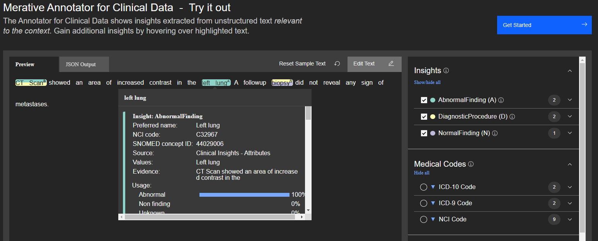

<!-- ---

copyright:
  years: 2020
lastupdated: "2020-02-11"

keywords: annotator clinical data, clinical data, annotation

subcollection: wh-acd

---

# Clinical Insights Normality Model (Preview) -->

The normality model looks for language around certain target concepts (body parts, body substances, diagnostic tests, and organism functions) that indicate a normal or abnormal finding about a patient.  



The demo application above shows an example of how to use the scores from the normality model to create attributes.  In this case, the language around CT scan and left lung appears suspicious while the language around biopsy appears normal.  The normality scores are used to create the appropriate AbnormalFinding/NormalFinding attributes.

The usage section of the JSON response indicates how a nature of the normality judgement.

## usage

| Feature | Description |
|:--------|-------------|
| normalScore | The language around a target indicates there are no problems. |
| abnormalScore | The language around a target indicates that there may be a problem. |
| unknownScore | There is a judgement or measurement associated with a target, but there is no language that allows the model to make a value judgement.  The most common type of unknowns are quantitative unknowns where a numeric value is associated with a measurement.  Lab values are a typical example of quantitative unknowns.  If you want to use lab values as part of your application, you can use the LabValue attribute that is part of the clinical insights cartridge. |
| nonFindingScore | The language around a target does not indicate a finding of any sort.  For example, if a clinic note says "We will schedule a CT scan for next week", there's no obvious finding that is associated with that instance of CT scan. |

## directlyAffectedScore
This score indicates if the normality target (the object being judged by the model) is the direct target of the normality judgement or something that is mentioned indirectly in context.  For example, consider the following two examples:

_There was a lesion located on the left lung._ - This example would have a high _directlyAffectedScore_ because the lesion is located on the body part in question.

_There was a lesion located 5 cm below the left lung._ - In this example, the lung is being used as a relative landmark.  This instance of _left lung_ would have a low _directlyAffectedScore_.


## evidence

| Feature | Description |
|:--------|-------------|
| begin | First character offset of the evidence for the normality judgement. |
| end | Last character offset of the evidence for the normality judgement. |
| coveredText | The evidence provided by the model as to why it made particular normality judgement (normal, abnormal, unknown) |

## modifiers

When the normality model runs, its evidence spans will be used to create linkages between procedures, diagnosis, and sites.  Those linkages are added to the relevant [Procedure](/docs/wh-acd?topic=wh-acd-clinical_insights_procedure#clinical_insights_procedure) or [Diagnosis](/docs/wh-acd?topic=wh-acd-clinical_insights_diagnosis#clinical_insights_diagnosis) as _modifiers_.  Those links are created as _associatedProcedures_ or _associatedDiagnosis_.  An example is shown below.


## Sample Response
This example demonstrates both an abnormal and normal finding.  Consider the following sample text:

_CT scan showed an area of increased contrast in the left lung.  A followup biopsy did not reveal any signs of metastases._

In this example, the CT scan shows something suspicious but the biopsy does not confirm it.  It is worth noting the distinction between nonFinding and normal in the case of _biopsy_.  The language around biopsy indicates that it was done and the findings were negative.  The normality model considers negative findings to be normal.  nonFinding is reserved for language that does not express a judgement one way or another.  If our example had been

_CT scan showed an area of increased contrast in the left lung.  A followup biopsy will be performed next week._

then _biopsy_ would have a high nonFindingScore.

Context scores for _CT scan_ in the first example:
```
"insightModelData": {
  "procedure": {
    "usage": {
      "explicitScore": 0.998,
       ...                     <--- procedure scores omitted for brevity
    },
    "modifiers": {
      "sites": [
        {
          "begin": 52,
          "end": 61,
          "coveredText": "left lung",
          "type": "abnormal"
        }
      ]
    }
  },
  "normality": {
    "usage": {
      "normalScore": 0.035,
      "abnormalScore": 0.965,
      "unknownScore": 0,
      "nonFindingScore": 0
    },
    "directlyAffectedScore": 1,
    "evidence": [
      {
        "begin": 8,
        "end": 61,
        "coveredText": "showed an area of increased contrast in the left lung"
      }
    ]
  }
}
```

Context scores for _biopsy_ in the first example:

```
"insightModelData": {
  "procedure": {
    "usage": {
      "explicitScore": 0.984,
      ...             <--- procedure scores omitted for brevity
  },
  "normality": {
    "usage": {
      "normalScore": 0.992,
      "abnormalScore": 0.008,
      "unknownScore": 0,
      "nonFindingScore": 0
    },
    "directlyAffectedScore": 1,
    "evidence": [
      {
        "begin": 82,
        "end": 120,
        "coveredText": "did not reveal any signs of metastases"
      }
    ]
  }
}
```

Body sites will also receive normality judgements.  Here is the context information attached to _left lung_.

```
"insightModelData": {
  "normality": {
    "usage": {
      "normalScore": 0,
      "abnormalScore": 1,
      "unknownScore": 0,
      "nonFindingScore": 0
    },
    "directlyAffectedScore": 1,
    "evidence": [
      {
        "begin": 0,
        "end": 51,
        "coveredText": "CT scan showed an area of increased contrast in the"
      }
    ]
  }
}
```

Examples of _associatedDiagnosis_ and _associatedProcedures_: if normality is enabled, it will create linkages between diagnosis and procedures as appropriate.  An example JSON response is shown below for the following text:

 _CT scan appeared to indicate the presence of a tumor in the left lung._


```     
"coveredText": "CT scan",
"negated": false,
"insightModelData": {
	"procedure": {
		"usage": {
			"explicitScore": 0.999,
			...
		"modifiers": {
			"associatedDiagnoses": [{
				"begin": 47,
				"end": 69,
				"coveredText": "tumor in the left lung"
			}]
		}
```

```
"coveredText": "tumor in the left lung",
"negated": false,
"insightModelData": {
 "diagnosis": {
   "usage": {
     "explicitScore": 0.991,
     ...
   "modifiers": {
     "associatedProcedures": [{
       "begin": 0,
       "end": 7,
       "coveredText": "CT scan"
     }]
   }
 }
```
