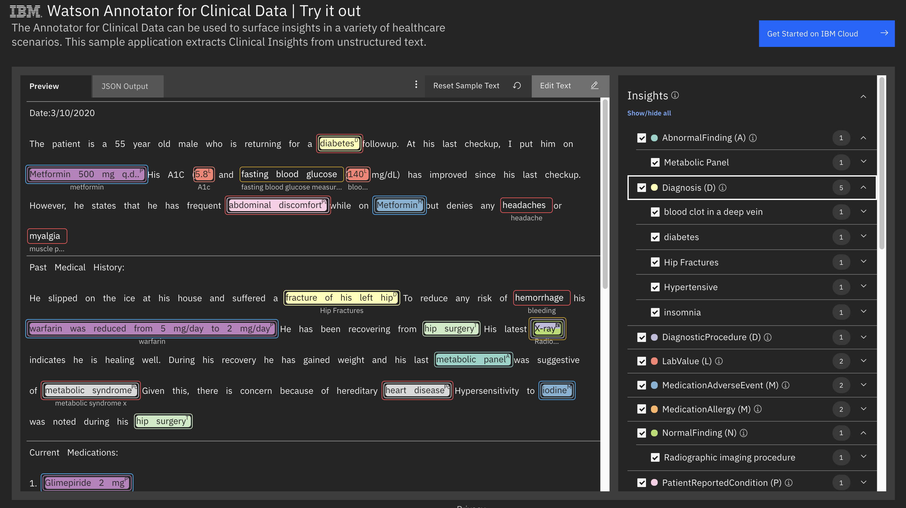

<!-- ---

copyright:
  years: 2020
lastupdated: "2020-02-11"

keywords: annotator clinical data, clinical data, annotation

subcollection: wh-acd

---

# Clinical Insights Overview -->

The clinical insights feature is a ready-to-use annotation capability within Annotator for Clinical Data that provides contextual information for problems, procedures, and medications identified in unstructured text.  It is composed of two parts:

1. Models that provide domain-specific context for various types of clinical information (medication, diagnosis, procedure, and normality).
2. Ready-to-use cartridge that answers a simple question - is the given information relevant to the patient?

There is an online [demo application](https://acd-try-it-out.mybluemix.net/preview) for the clinical insights cartridge.

The default attributes that are defined in the clinical insights cartridge can be customized.

You can use the Annotator for Clinical Data Configuration Editor to [customize attributes](/usage/customizing/) using the clinical insight model scores and other contextual information provided by {Annotator for Clinical Data.

## Models

Each model contributes contextual features to annotations that are either produced by standard IBM Clinical Data Annotator annotators or from custom annotations you create using the Annotator for Clinical Data Configuration Editor.  The Clinical Insights Models include:

1. [Medication](/clouddocs/clinical_insights_medication/)
2. [Procedure](/clouddocs/annotator_procedure/)
3. [Diagnosis](/clouddocs/clinical_insights_diagnosis/)
4. [Normality - Experimental](/clouddocs/clinical_insights_normality/)
5. [Temporal - Experimental](/clouddocs/temporal_overview/)
6. [Substance Use - Experimental](/clouddocs/substance_use_overview/)
