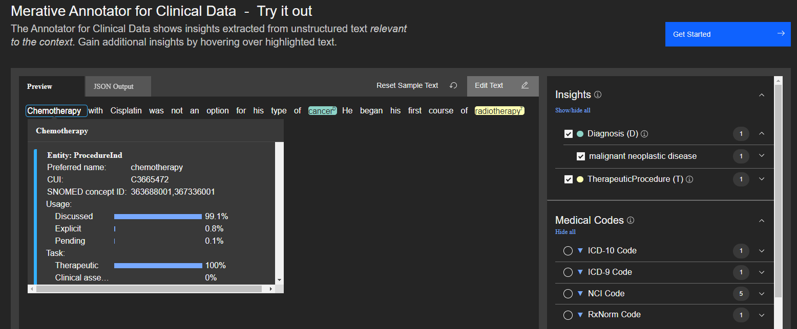

<!--                                                                    -->
<!-- (C) Copyright Merative US L.P. and others 2020, 2023               -->
<!--                                                                    -->
<!-- SPDX-License-Identifier: Apache-2.0                                -->
<!--                                                                    -->

<!-- # Clinical Insights Procedure Model -->

The procedure model provides information about how the procedure applies to the the patient and other classification information about the procedure.



The demo application above shows an example of how to use the scores from the procedure model to create attributes.  In this example, Chemotherapy has a high _discussed_ score and is not promoted to an attribute.  Radiotherapy does apply to the patient in this example and is promoted to an attribute.

The usage section of the JSON response indicates how a procedure applies to a patient.

## usage

| Feature | Description |
|:--------|-------------|
| explicitScore | The procedure has been done. |
| pendingScore | The procedure has been scheduled or is highly recommended by a physician. |
| discussedScore | Other mentions of the procedure that do not directly apply to the patient. |

## task

| Feature | Description |
|:--------|-------------|
| therapeuticScore | This procedure is meant to treat a condition. |
| diagnosticScore | This procedure is meant to diagnose a condition. |
| surgicalTaskScore | This procedure is a subtask of a larger surgical process. |
| clinicalAssessmentScore | This procedure is a physician's evaluation of a patient. |
| labTestScore | This procedure is a lab test. |

## type

| Feature | Description |
|:--------|-------------|
| deviceScore | The procedure involves an implanted device. |
| materialScore | The procedure involves grafts or other material implants. |
| medicationScore | The procedure involves the administration of a medication. |
| conditionManagementScore | An ongoing procedure to manage a long term condition. |
| procedureScore | Any other type of procedure. |

## Sample Response

Consider the following sample text.

_Chemotherapy with Cisplatin was not an option for his type of cancer._

The clinical insight features for Chemotherapy might look as follows:

```
"insightModelData": {
	"procedure": {
		"usage": {
			"explicitScore": 0.035,
			"pendingScore": 0.002,
			"discussedScore": 0.963
		},
		"task": {
			"therapeuticScore": 0.999,
			"diagnosticScore": 0,
			"surgicalTaskScore": 0.001,
			"clinicalAssessmentScore": 0
		},
		"type": {
			"deviceScore": 0,
			"materialScore": 0,
			"medicationScore": 0.994,
			"procedureScore": 0.005,
			"conditionManagementScore": 0
		}
	}
}
```
