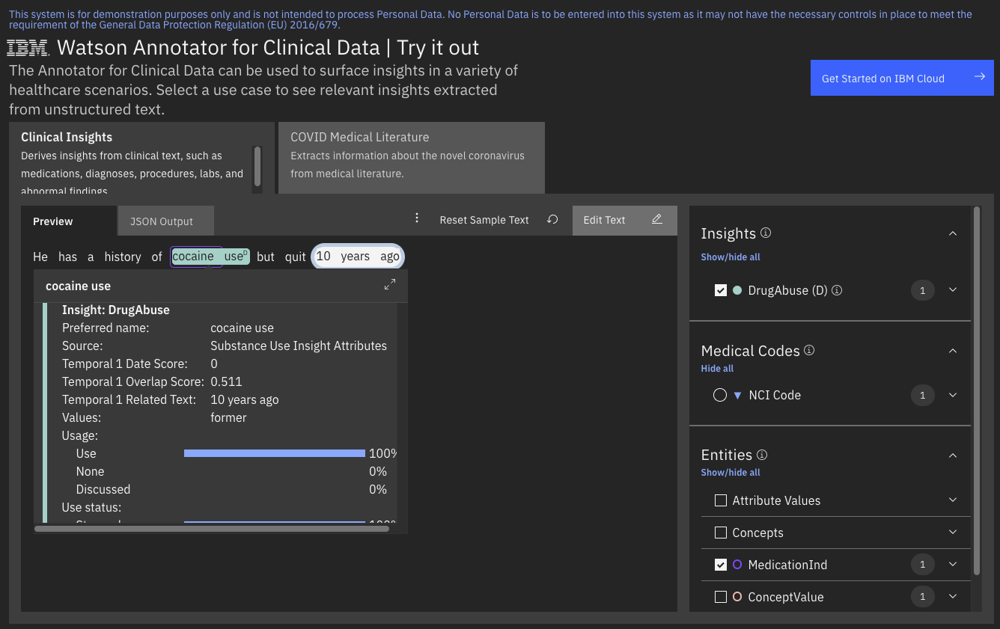

<!--                                                                    -->
<!-- (C) Copyright Merative US L.P. and others 2021, 2023               -->
<!--                                                                    -->
<!-- SPDX-License-Identifier: Apache-2.0                                -->
<!--                                                                    -->


<!-- # Substance Use Illicit Drug Model (Preview) -->

The substance use illicit drug model provides information about the illicit drug usage that applies to the patient.



The demo application above shows an example of how to use the scores from the substance use illicit drug model to create attributes.  In this example, "cocaine use" has a high _use_ and _abuse_ scores and is promoted to a DrugAbuse attribute by the cartridge scoring rules. The example also has a high _stopped_ score which results in a value of _former_ for the DrugAbuse attribute.

The usage section of the JSON response indicates how the substance use illicit drug applies to a patient.

## usage

| Feature | Description |
|:--------|:------------|
| useScore | Evidence that there has been illicit drug use by the patient. |
| noneScore | Evidence that there has been no illicit drug use by the patient. |
| discussedScore | Other mentions of illicit drugs that do not directly apply to the patient (For example:  "Patient was counseled about the dangers of using recreational drugs.") |

## useStatus

| Feature | Description |
|:--------|:------------|
| stoppedScore | Evidence that the patient is a former illicit drug user. |
| neverScore | Evidence that the patient has never used illicit drugs. |

## useDimension

| Feature | Description |
|:--------|:------------|
| medicalScore | Evidence that the drug has been used for medical purposes. |
| abuseScore | Evidence that there is illicit drug abuse by the patient. |

## Other illicit drug features

| Feature | Description |
|:--------|:------------|
| exposureScore | The patient has been exposed to second-hand illicit drugs, such as in utero or through second-hand marijuana smoke. |
| nonPatientScore | The illicit drug use does not apply to the patient. (For example: "She has a family history of polysubstance abuse.") |

Note that additional features, such as the status and dimension events, only look at local context clues and do not try to reason across large distances in the text or multiple documents.  

### Sample Response

Consider the following sample text.

_He has a history of cocaine use, but quit 10 years ago._

The clinical insight features for "cocaine use" might look as follows:

```
"insightModelData": {
  "illicitDrug": {
    "usage": {
      "useScore": 1,
      "noneScore": 0,
      "discussedScore": 0
    },
    "useStatus": {
      "stoppedScore": 1,
      "neverScore": 0
    },
    "useDimension": {
      "medicalScore": 0,
      "abuseScore": 1
    },
    "exposureScore": 0,
    "nonPatientScore": 0
  }
}
```
