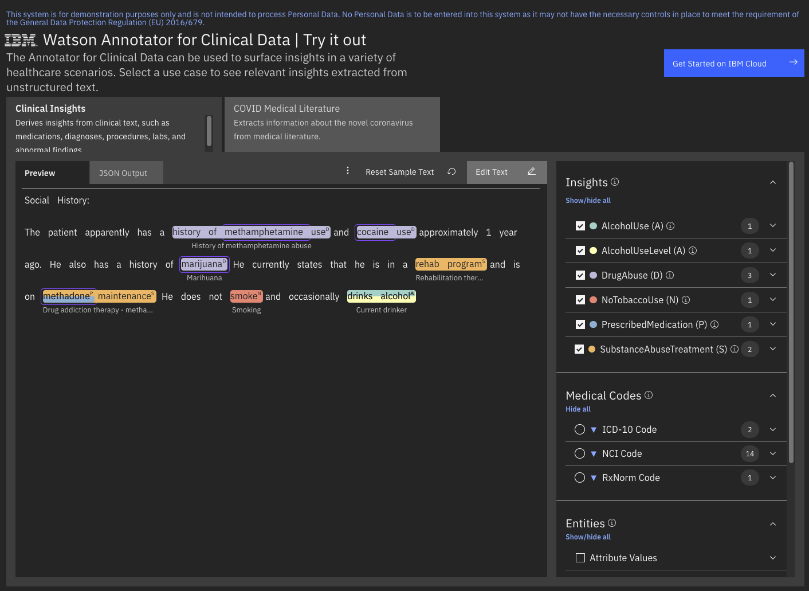

<!--                                                                    -->
<!-- (C) Copyright Merative US L.P. and others 2021, 2023               -->
<!--                                                                    -->
<!-- SPDX-License-Identifier: Apache-2.0                                -->
<!--                                                                    -->

<!-- # Substance Use Overview (Preview) -->

The substance use feature is a ready-to-use annotation capability within Annotator for Clinical Data that provides contextual information for alcohol use, tobacco use, illicit drug use, and substance abuse treatment identified in unstructured text.  

The Annotator for Clinical Data [demo application](https://merative.net/tryacd) allows you to see how substance use is detected.

The substance use capability is currently available through [Clinical Insights](/clouddocs/clinical_insights_overview/).  

## Models

Each model contributes contextual features to annotations that are either produced by standard Annotator for Clinical Data annotators or from custom annotations you create using the Annotator for Clinical Data Configuration Editor.  The Substance Use Models include:

1. [Alcohol](/clouddocs/substance_use_alcohol/)
1. [Tobacco](/clouddocs/substance_use_tobacco/)
1. [Illicit Drug](/clouddocs/substance_use_illicit_drug/)
1. [Substance Abuse Treatment](/clouddocs/substance_abuse_treatment/)
