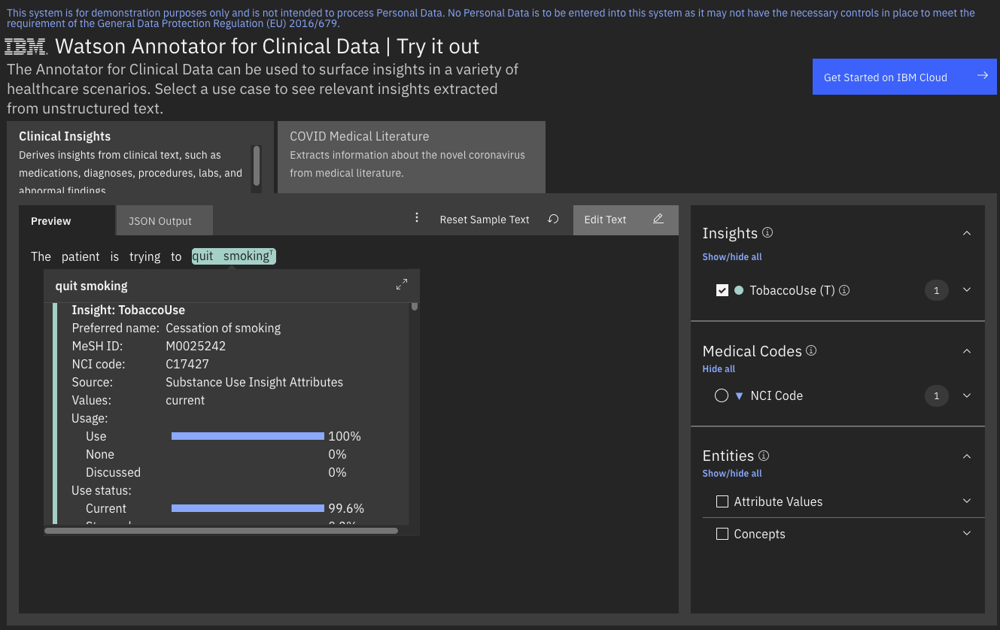

<!-- ---

copyright:
  years: 2021
lastupdated: "2021-11-09"

keywords: annotator clinical data, clinical data, annotation

subcollection: wh-acd

---

# Substance Use Tobacco Model (Preview) -->

The substance use tobacco model provides information about tobacco use that applies to the patient.



The demo application above shows an example of how to use the scores from the substance use tobacco model to create attributes.  In this example, "quit smoking" has a high _use_ score and is promoted to a TobaccoUse attribute by the cartridge scoring rules. The example also has a high _current_ score which results in a value of _current_ for the TobaccoUse attribute.

The usage section of the JSON response indicates how the tobacco use applies to a patient.

## usage

| Feature | Description |
|:--------|:------------|
| useScore | Evidence that there has been tobacco use by the patient. |
| noneScore | Evidence that there has been no tobacco use by the patient. |
| discussedScore | Other mentions of tobacco that do not directly apply to the patient (For example:  "No smoking or eating within 2 hours of the procedure.") |

## useStatus

| Feature | Description |
|:--------|:------------|
| currentScore | Evidence that the patient is an active tobacco user. |
| stoppedScore | Evidence that the patient is a former tobacco user. |
| neverScore | Evidence that the patient has never used tobacco products. |

Note that the status events only look at local context clues and do not try to reason across large distances in the text or multiple documents.  

## Other tobacco features

| Feature | Description |
|:--------|:------------|
| exposureScore | The patient has been exposed to second-hand smoke. |
| nonPatientScore | The tobacco use does not apply to the patient. (For example: "Her grandfather was a heavy smoker.") |
| treatmentScore | The patient is receiving treatment for their tobacco use. |

### Sample Response

Consider the following sample text.

_The patient is trying to quit smoking._

The clinical insight features for "quit smoking" might look as follows:

```
"insightModelData": {
  "tobacco": {
    "usage": {
      "useScore": 1,
      "noneScore": 0,
      "discussedScore": 0
    },
    "useStatus": {
      "currentScore": 0.996,
      "stoppedScore": 0.002,
      "neverScore": 0
    },
    "exposureScore": 0,
    "nonPatientScore": 0,
    "treatmentScore": 0.003
  }
}
```
