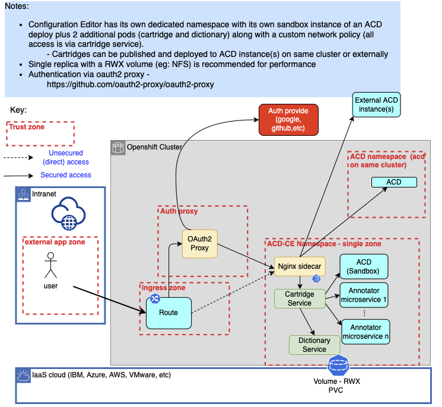

<!-- ---

copyright:
  years: 2020
lastupdated: "2020-04-01"

keywords: annotator clinical data, clinical data, annotation

subcollection: wh-acd

--- -->

<!-- # Overview -->

The following will walk through the steps necessary to set up and configure the Annotator for Clinical Data Configuration Editor running in an existing Red Hat OpenShift cluster.  Setup includes setting up the Configuration Editor and its required ACD sandbox instance.  This environment can be used to create, edit and preview Annotator for Clinical Data (ACD) cartridges.  The Configuration Editor can also be configured to deploy and test against other ACD instances, either running on the same cluster or elsewhere. The diagram below shows the flows in and out of the server you'll be setting up.  Ensure any firewalls are open to allow this traffic.



## Prerequisites

### Hardware Prerequisites

The ACD Configuration Editor hardware prerequisites are in addition to those required by an installation of ACD Container Edition as a dedicated sandbox instance.  Refer to [ACD Container Edition Prerequisites](https://merative.github.io/acd-containers/installing/prereqs/).

| Component | Number of worker nodes | CPU/node | Memory/node (G) |
|:----------|------------------------|----------|-----------------|
| ACD Configuration Editor | 3 (In addition to those for ACD Container Edition) | 8 | 32 |

For high availability, run 3 replicas of the ACD Configuration Editor on a minimum of 3 worker nodes (in addition to those for the ACD sandbox instance).  For a development or test environment, 1 or 2 replicas can be configured.

### Software Prerequisites

- OpenShift Cluster

  - Annotator for Clinical Data Container Edition - Dedicated sandbox instance<br/>

    The ACD Configuration Editor requires an installation of ACD Container Edition as a dedicated sandbox instance.  Refer to [Installing ACD](https://merative.github.io/acd-containers/installing/installing/) for requirements and installation instructions.  The ACD Configuration Editor needs to be deployed into the same namespace as the dedicated sandbox instance.<br/><br/>

    Storage considerations:  For performance reasons, it is recommended that the setup of ACD and ACD Configuration Editor use a [file-based storage option](https://merative.github.io/acd-containers/installing/setup-namespace/).

- Client for Installation

  - [Helm 3](https://helm.sh/docs/intro/quickstart/)

## Installing ACD Configuration Editor

1. Download the ACD Configuration Editor deployment bundle from the [ACD Container Edition repository](https://github.com/merative/acd-containers/tree/master/config-editor).
1. Untar the deployment bundle:
  `tar -xvf config-editor-<timestamp>.tar.gz`
1. Change directory:<br/>
   `cd Kubernetes`
1. Log in to the OpenShift cluster on the command line:<br/>
   `oc login ...`
1. Switch to the same namespace that the sandbox instance of ACD is running in.<br/>

   If you used the default namespace during ACD's installation, this is `merative-acd-operator-system`.<br/>

   Run the command:<br/>
   `oc project <acd namespace>`<br/>
   - where `<acd namespace>` is the namespace where the ACD sandbox is running.

5. Install the Concept Dictionary microservice using Helm:

```
helm install merative-acd-ce-cdc \
     merative-acd-ce/cdc/chart/cdc \
     --set replicas=1 \
     --set configurationStorage.file.volume.existingClaimName=<pvc name> \
     --namespace <acd namespace>
```

- where `<acd namespace>` is the namespace where the ACD sandbox instance is running
- where `<pvc name>` is the persistent volume claim (PVC) the ACD sandbox instance is using

6. Verify the Concept Dictionary microservice is running.<br/>

   Find the `merative-acd-cdc` pod by running the command:<br/>
   `kubectl get pods -n <acd namespace>`<br/>

   Run a health check against the pod using the following command. It should list `"serviceState":"OK"`.

```
kubectl exec <pod name> -c merative-acd-cdc -n <acd namespace> -- curl -sk 'https://localhost:9443/services/concept_dictionary/api/v1/status/health_check'
```

7. Install the Cartridge microservice using Helm:

```
helm install merative-acd-ce-crtg \
     merative-acd-ce/crtg/chart/crtg \
     --set replicas=1 \
     --set configurationStorage.file.volume.existingClaimName="<pvc name>" \
     --namespace <acd namespace>
```

- where `<acd namespace>` is the namespace where the ACD sandbox instance is running
- where `<pvc name>` is the persistent volume claim (PVC) the ACD sandbox instance is using

8. Verify the Cartridge microservice is running.<br/>

   Find the `merative-acd-crtg` pod by running the command:<br/>
   `kubectl get pods -n <acd namespace>`<br/>

   Run a health check against the pod using the following command. It should list `"serviceState":"OK"`.

```
kubectl exec <pod name> -c merative-acd-crtg -n <acd namespace> -- curl -sk 'https://localhost:9443/services/cartridge/api/v1/status/health_check'
```

## ACD Configuration Editor Authentication

Accessing ACD Configuration Editor can be set up with no authentication or using an Identity Provider for authentication.

### Option 1: No authentication

If ACD Configuration Editor is running in a restricted environment and no authentication is needed, a simple OpenShift route can be configured.

1. Download the yaml below and save it as `merative-acd-ce-macroservice.yaml`

```
apiVersion: route.openshift.io/v1
kind: Route
metadata:
  name: merative-acd-crtg
spec:
  host:
  port:
    targetPort: crtg-https-pxy
  tls:
    termination: passthrough
  to:
    kind: Service
    name: merative-acd-crtg
```

2. Create the ACD Configuration Editor route:<br/>
`oc create -f merative-acd-ce-macroservice.yaml -n <acd namespace>`

### Option 2: Identity Provider authentication

There are multiple Identity Providers for providing an authentication layer for ACD Configuration Editor (Azure Active Directory, Google, IBMId, etc). This section will discuss the configuration using [OIDC](https://en.wikipedia.org/wiki/OpenID) with [OpenShift OAuth 2.0 Proxy](https://github.com/openshift/oauth-proxy).

1. Create a project/namespace for the proxy and set the current namespace to it. For the remainder of this document, we will use the example `merative-acd-ce-oauth`.
   - `oc create namespace merative-acd-ce-oauth`
   - `oc project merative-acd-ce-oauth`

2. Download the yaml below and save it as `merative-acd-ce-oauth.yaml`

```
kind: List
apiVersion: v1
items:
# Create a secure connection to the proxy via a route
- apiVersion: route.openshift.io/v1
  kind: Route
  metadata:
    name: proxy
  spec:
    to:
      kind: Service
      name: proxy
    tls:
      termination: Reencrypt
- apiVersion: v1
  kind: Service
  metadata:
    name: proxy
    annotations:
      service.alpha.openshift.io/serving-cert-secret-name: proxy-tls
  spec:
    ports:
    - name: public-https
      port: 443
      targetPort: 8443
    selector:
      app: proxy
# Launch a proxy as a deployment
- apiVersion: apps/v1
  kind: Deployment
  metadata:
    name: proxy
  spec:
    replicas: 1
    selector:
      matchLabels:
        app: proxy
    template:
      metadata:
        labels:
          app: proxy
      spec:
        containers:
        - name: oauth-proxy
          image: quay.io/oauth2-proxy/oauth2-proxy
          imagePullPolicy: IfNotPresent
          ports:
          - containerPort: 8443
            name: public-https
          args:
          - --client-id=<client id>
          - --client-secret=<client secret>
          - --cookie-secret=<cookie secret>
          - --cookie-secure=true
          - --email-domain=*
          - --https-address=:8443
          - --oidc-issuer-url=<oidc issuer url>
          - --pass-host-header=true
          - --pass-user-headers=true
          - --provider=oidc
          - --provider-display-name="ACD OIDC Provider"
          - --redirect-url=https://<hostname>/oauth2/callback
          - --request-logging=true
          - --set-authorization-header=true
          - --set-xauthrequest=true
          - --show-debug-on-error=true
          - --skip-auth-strip-headers=true
          - --skip-provider-button=true
          - --ssl-upstream-insecure-skip-verify=true
          - --upstream=https://merative-acd-crtg.merative-acd-operator-system.svc:443/
          - --tls-cert-file=/etc/tls/private/tls.crt
          - --tls-key-file=/etc/tls/private/tls.key
          volumeMounts:
          - mountPath: /etc/tls/private
            name: proxy-tls
        volumes:
        - name: proxy-tls
          secret:
            secretName: proxy-tls
```

- where `<client id>` is the OAuth client id
- where `<client secret>` is the OAuth client secret
- where `<cookie secret>` is the generated cookie secret
- where `<oidc issuer url>` is the OIDC issuer URL, e.g. `https://sts.windows.net/xxxxxxxx-xxxx-xxxx-xxxx-xxxxxxxxxxxx/` for Azure Active Directory
- where `<hostname`> is the OAuth proxy hostname, e.g. `proxy-merative-acd-ce-oauth.xxx.us-xxxx.containers.appdomain.cloud` for IBM Cloud

3. Create the proxy's deployment, proxy's service, and proxy's route:<br/>
  `oc create -f merative-acd-ce-oauth.yaml`<br/>

   More options and details for the proxy are available at [OpenShift OAuth Proxy](https://github.com/openshift/oauth-proxy#openshift-oauth-proxy).  Information on troubleshooting the OAuth Proxy is found at [Troubleshooting the OAuth Proxy](/troubleshooting/troubleshooting-the-oauth-proxy/).  More details and options such as secret generation and cookie expiration are defined in the base [OAuth proxy](https://oauth2-proxy.github.io/oauth2-proxy/docs/configuration/overview/) docs.

### Verification

Go to the following URL to verify authentication and the proxy route:<br/>
`https://<hostname>/services/cartridge/cartridge-main.html`<br/>

You may get an error about the self-signed certificate in the browser, but you can use advanced option to continue to the site.  In Google Chrome, if there is no button to proceed, click on the advanced warning text and type `thisisunsafe` (all one word lower-case--type it after clicking on the warning) and it should proceed.  This is only needed the first time in.  To fix this, add a trusted CA-issued certificate to the Apache HTTP server.

After you are in, you are at the main ACD Configuration Editor catalog page. Initially, there are no default cartridges so your list will be empty.  You can install the base [Clinical Insights](https://github.com/merative/acd-cartridges) cartridge via an import and extend that cartridge or create your own new cartridge.  In the upper right corner of the page, click the mortar board tutorial link to see Introductory videos and click the "?" icon to view the Getting Started Guide.  

Periodically, refer to this page for updates to the Configuration Editor packages and see below for update instructions.

### Additional Configurations

The ACD Configuration Editor can be configured to put a 'Logout' button on the user interface. This button can clear cookies and redirect to an authentication URL to perform logout. In order to configure the ability to logout of your instance, you can configure certain parameters under the Cartridge service in the `merative-acd-ce/crtg/chart/crtg/values.yaml` file.<br/>

Custom properties include:

- `com_ibm_watson_health_car_auth_enable_logout` Set this property as true to enable logout.
- `com_ibm_watson_health_car_auth_logout_url` Set this property to the URL your authentication method uses to perform logout, if applicable.

  - Note:  Your "url" property must be encoded to ensure it is correctly pulled into the ACD Configuration Editor. An easy way to perform the encoding is with the Javascript method `encodeURIComponent` or with [https://www.urlencoder.org/](https://www.urlencoder.org/).
  - Your URL will likely need a redirect URL, in which case we recommend redirecting to the Configuration Editor main page, which is at `your-acd-config-editor-site/services/cartridge/cartridge-main.html`.

- `com_ibm_watson_health_car_auth_logout_cookies` Set this property to the cookies your authentication method uses to store session information. If there are multiple cookies, comma-separate them. These will be cleared in the logout process.

## Deploying to Custom ACD Configuration Editor Environments (optional)

ACD Configuration Editor provides the ability to deploy published cartridges to ACD instances in production environments.  To configure additional custom environments, the following files must be modified and the Cartridge microservice must be redeployed using Helm (see Installing ACD Configuration Editor instructions above).

1. `merative-acd-ce/crtg/chart/crtg/rev-proxy.conf`

```
location /<identifier>/ {
    resolver 8.8.8.8;
    proxy_set_header Authorization $http_authorization;
    set $prod_dev "<hostname>";
    proxy_set_header Host $prod_dev;
    proxy_ssl_server_name on;
    if ($request_uri ~* "/<identifier>(/.*$)") {
        set  $path_remainder $1;
    }
    proxy_pass https://$prod_dev/wh-acd$path_remainder;
}
```

- where `<identifier>` is the identifier of the custom ACD instance, e.g. `custom-acd`
- where `<hostname>` is the hostname of the custom ACD instance, e.g. `us-south.wh-acd.cloud.ibm.com`

2. `merative-acd-ce/crtg/chart/crtg/values.yaml`

```
  - name: "com_ibm_watson_health_car_acd_host_3_label"
    value: "Annotator for Clinical Data - <identifier>"
  - name: "com_ibm_watson_health_car_acd_host_3_url"
    value: "https://<hostname>/wh-acd/api"
  - name: "com_ibm_watson_health_car_acd_host_3_proxy"
    value: "<identifier>"
  - name: "com_ibm_watson_health_car_acd_host_3_auth"
    value: "APIKey"
  - name: "com_ibm_watson_health_car_acd_host_3_phi"
    value: "true"
```

- where `<identifier>` is the identifier of the custom ACD instance, e.g. `custom-acd`
- where `<hostname>` is the hostname of the custom ACD instance, e.g. `us-south.wh-acd.cloud.ibm.com`

ACD Hosts must be indexed in the properties file using `com_ibm_watson_health_car_acd_host_{index}` as the beginning of their property name. The index must start at "3". The properties are:

- `_label` which is the name for the host that will be shown in the Configuration Editor
- `_url` which is what will be shown in the host description in the Configuration Editor
- `_proxy` which is the proxy you have configured in your `merative-acd-ce/crtg/chart/crtg/rev-proxy.conf` file mentioned in Step 1 in this section
- `_phi` which is either true or false based on whether this ACD Host can support protected health information
- `_auth` which specifies the type of authentication the host requires.  The three possible authentication types are:

  - APIKey: Used for cloud hosts. It will prompt the user to enter their API Key, and then use the identity server specified in the properties file in the field `com_ibm_watson_health_car_identity_server` (default is `https://iam.cloud.ibm.com/identity/token`) in order to request a bearer token using the API Key the user entered.
  - Bearer: Used for an ACD Container Edition host, and will prompt the user for their Bearer token to the ACD Container Edition and expire every 24 hours.
  - Leaving the field blank: Used for no authentication if the host does not require any authentication.

## Backing up Your Data

All configuration data such as cartridges, flows, dictionaries, filters, etc., are stored in the storage set up as part of the ACD [prerequisites](/configeditor/download_openshift/#prerequisites). The recommendation is to use file-based storage via a persistent volume claim (PVC). Backup of this storage is implementation-specific. It is recommended to have at least daily backups in case a restore is needed.

## Updating ACD Configuration Editor

To update to a newer version of the ACD Configuration Editor follow these steps:

1. Back up any customizations in:

`merative-acd-ce/crtg/chart/crtg/rev-proxy.conf`
`merative-acd-ce/crtg/chart/crtg/values.yaml`

2. Download the latest project and unpack it as above.
3. Delete the existing Helm deployments:

`helm delete merative-acd-ce-crtg`
`helm delete merative-acd-ce-cdc`

4. Merge in any customizations to the new project files.

## Notices

The Configuration Editor is Java compatible.


[View Program Terms](https://ibm.biz/BdfmAB)
