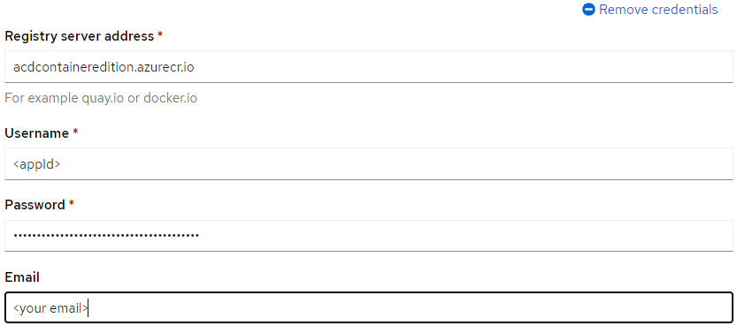

_Note: The Merative Annotator for Clinical Data Container Edition is the replacement for the IBM Watson Annotator for Clinical Data Container Edition. All Annotator for Clinical Data (ACD) Container Edition consumers will need to migrate their ACD instances from IBM Watson ACD to Merative ACD by December 31, 2022._

_Refer here for installation instructions for [IBM Watson Annotator for Clinical Data Container Edition](/installing/installing-ibm/)._

To install Annotator for Clinical Data Container Edition, you may use either the OpenShift Container Platform web console or the `oc` command line utility.

## Overview

Annotator for Clinical Data Container Edition is an [operator-based](https://kubernetes.io/docs/concepts/extend-kubernetes/operator/) release and uses a custom resource to define your ACD configuration.

The ACD operator uses the custom resource to deploy and manage the entire lifecycle of each ACD instance. Custom resources are presented as YAML configuration documents that define instances of the `Acd` custom resource type.

A new instance of the `Acd` custom resource belonging to the `acd.merative.com` group must be installed. There is no upgrade path from the IBM Watson Annotator for Clinical Data Container Edition to Merative Annotator for Clinical Data Container Edition. Refer to the [Migration Considerations](/migration/considerations/) when planning for and migrating from an IBM Watson ACD instance to a Merative ACD instance.

Installing ACD has three phases:

1. Install the Merative ACD operator catalog:  This will deploy the catalog from which the ACD operator can be installed.
1. Install the ACD operator: This will deploy the operator that can be used to install and manage your ACD instances.
1. Install one or more replicas of ACD by using the ACD operator.

## Before you begin

- [Plan for your installation](/planning/namespace/), such as preparing for persistent storage, considering security options, and planning for performance and capacity.
- Purchase ACD to [obtain your ACD registry credentials](/installing/installing/#obtain-acd-registry-credentials).
- Log in to [verify ACD registry access](/installing/installing/#verifying-acd-registry-access).
- Set up your environment according to the [prerequisites](/installing/prereqs/), including setting up your OpenShift Container Platform.
- Obtain the connection details for your OpenShift Container Platform cluster from your administrator.
- [Set up](/installing/setup-namespace/) your project and project dependencies if required for your environment.

## Obtain ACD registry credentials

When you purchase Annotator for Clinical Data Container Edition, you will receive credentials that give you access to the Azure Active Directory ACD registry.  Credentials for the Azure AD ACD registry are used to pull the ACD images.

**Note:** Customers must use their customer ID to log in to their `Merative` account. The customer must request the credentials so the ownership and management of the ACD authorization stays with them.

## Verifying ACD registry access

A pull secret consists of a username and password used to authenticate the user with the container registry to ensure the user is entitled to pull images.

Before setting up the pull secret, verify your credentials can access the ACD registry. You should have Azure Active Directory (AAD) service principal credentials from your account onboarding process. See [authentication with the service principal](https://learn.microsoft.com/en-us/azure/container-registry/container-registry-auth-service-principal#authenticate-with-the-service-principal) for guidance.

Example (Docker with ACD registry credentials):

```
docker login acdcontaineredition.azurecr.io --username <username>
```

- where `<username>` is the service principal's application (client) ID
- where `Password:` is the service principal's password (client secret); entered the password when prompted for it

Verify access by pulling that latest catalog image from the registry.

```
docker pull acdcontaineredition.azurecr.io/acd-ce/merative-acd-operator-catalog:latest
```

Confirm the image was successfully downloaded.

### ACD registry pull secret

In order for ACD images to be pulled from the ACD registry, a pull secret must be added to the environment. This can be set up using one of the following:

1. Added to the OpenShift global pull secrets
1. Added to the ACD operand service account

#### Option 1: OpenShift global pull secret installation

Add the pull secret to the OpenShift global pull secret via the OpenShift web console or oc command line.

Adding a global pull secret using the OpenShift web console.  This method is much less error prone.

1. Use the RedHat OpenShift Container Platform web console and select `Workloads -> Secrets` in the `openshift-config` project.

1. Select the `pull-secret` object from the list of secrets.

1. Select `Actions -> Edit Secret` to bring up the secret editor for this secret.

1. Edit an existing credential for your registry if it already exists or Select `Add credentials` at the bottom and fill in the new pull secret credentials.

   

Adding a global pull secret using the oc command line:

1. Extract the current global image pull secret from the cluster into a file in the current directory named `.dockerconfigjson`

  ```
  oc extract secret/pull-secret --namespace openshift-config --to=.
  ```

1. Create a base64 encoded string with the ACD registry credentials, such as the service principal client ID (username) and client secret (password), as it aligns with your access method.

  ```
  printf "<username>:<password>" | base64
  ```

1. Edit the `.dockerconfigjson` file and **ADD** a new JSON object to the existing auths object with the credentials for the ACD registry. For example:

   ```
   "acdcontaineredition.azurecr.io": {
       "auth": "YjM3ODBhpaxxxxxxxxxxxxxxxxxxxxxxxxxxxxxxxxxxxxxxxxmljVTk==",
       "email": "xxx@nomail.relay.merative.com"
   }
   ```

1. Update the global image pull secret with the updated credentials:

  ```
  oc set data secret/pull-secret --namespace openshift-config --from-file=.dockerconfigjson
  ```

1. Monitor the node status using the command:

  ```
  oc get nodes
  ```

1. When the nodes are finished restarting, your cluster is now ready to pull images from the ACD registry.

For more information on OpenShift pull secrets, refer to [Using image pull secrets](https://docs.openshift.com/container-platform/4.7/openshift_images/managing_images/using-image-pull-secrets.html#images-update-global-pull-secret_using-image-pull-secrets).

#### Option 2: Service account pull secret installation

To add the pull secret to individual ACD operand service accounts:

1. Create a secret

   ```
   kubectl create secret docker-registry acd-registry-credentials \
       --docker-server=acdcontaineredition.azurecr.io \
       --docker-username=<username> \
       --docker-password=<password> \
       --docker-email=<email_address> \
       --namespace=<namespace>
   ```

   - `<username>` is the service principal's application (client) ID
   - `<password>` is the service principal's password (client secret)

1. After the ACD operand has been installed, the service account must be patched to point to the secret.

  NOTE: If using the current release of the ACD Container Edition, this `acd-registry-credentials` pull secret is already defined in the operand service account so the patch step is no longer necessary.

   ```
   kubectl patch serviceaccount merative-acd-operand \
       --namespace <namespace> \
       --patch '{"imagePullSecrets": [{"name": "acd-registry-credentials"}]}'
   ```

1. Then the ACD operand pods must be restarted

   ```
   kubectl delete pods \
       --namespace <namespace> \
       --all
   ```

## Installing the Merative ACD operator catalog

Before you can install the ACD operator and use it to create instances of the ACD service, you must have a catalog source which includes ACD. ACD is available with the ACD operator catalog.

To add the ACD operator catalog:

1. Create a file for the ACD operator catalog source with the following content, and save as `ACDCatalogSource.yaml`:

   ```yaml ACDCatalogSource.yaml
   apiVersion: operators.coreos.com/v1alpha1
   kind: CatalogSource
   metadata:
      name: merative-acd-operator-catalog
      namespace: openshift-marketplace
   spec:
      displayName: "ACD Operator Catalog"
      publisher: Merative
      sourceType: grpc
      image: acdcontaineredition.azurecr.io/acd-ce/merative-acd-operator-catalog:latest
      updateStrategy:
        registryPoll:
          interval: 45m
   ```

1. Log in to your Red Hat OpenShift Container Platform as a cluster administrator by using the `oc` CLI.

1. Create the source by using the following command:

  ```
  oc create -f ACDCatalogSource.yaml
  ```

The ACD operator catalog source is added to the OperatorHub catalog, making the ACD operator available to install.

## Installing the ACD operator

### Install the ACD operator using the web console

To install the ACD operator through the OpenShift Container Platform web console, do the following:

1. Log in to the OpenShift Container Platform [web console](https://docs.openshift.com/container-platform/4.7/web_console/web-console.html) using your login credentials.
1. Expand the **Operators** dropdown and select **OperatorHub** to open the **OperatorHub** dashboard.
1. Select the project you want to use as the target namespace for your ACD deployment.
1. In the **All Items** search box enter `ACD` to locate the operator title.
1. Click the **Merative ACD** tile to open the install side panel.
1. Click the **Install** button to open the **Create Operator Subscription** dashboard.
1. Select the chosen installation mode that suits your requirements. If the installation mode is **A specific namespace on the cluster**, select the target namespace you created previously.
1. Select the approval strategy that suits your requirements. If set to **Automatic**, the [Subscription](https://docs.openshift.com/container-platform/4.7/operators/understanding/olm/olm-understanding-olm.html#olm-subscription_olm-understanding-olm) resource uses [Operator Lifecycle Manager (OLM)](https://docs.openshift.com/container-platform/4.7/operators/understanding/olm/olm-understanding-olm.html#olm-overview_olm-understanding-olm) to manage and upgrade the operator to ensure that the latest version is always running in the cluster. With **Manual** approval set, a project administrator must manually approve the install plan to enable the upgrade. See the [upgrading](../../installing/upgrading) section for more details.
1. Click **Install** to begin the installation.

The installation can take a few minutes to complete.

## Installing the ACD service

Instances of ACD can be created after the ACD operator is installed.

If the ACD operator was installed into a specific namespace, then it can only be used to manage instances of ACD in that namespace.

If the ACD operator was installed for all namespaces, then it can be used to manage instances of ACD in any namespace, including those created after the ACD operator was deployed.

When installing an instance of ACD, ensure you are using a namespace that an ACD operator is managing.

### Install the ACD service by using the web console

To install the ACD service through the OpenShift Container Platform web console, do the following:

1. Log in to the OpenShift Container Platform [web console](https://docs.openshift.com/container-platform/4.7/web_console/web-console.html) using your login credentials.
1. Expand the **Operators** dropdown and select **Installed Operators** to open the **Installed Operators** page.
1. Expand the **Project** dropdown and select the project the operator is installed in. Select the **Annotator for Clinical Data** operator link in the **Name** column. If the operator is not shown, it is either not installed or not available for the selected namespace.
1. In the **Operator Details** dashboard, click the **Annotator for Clinical Data** tab.
1. Click the **Create Acd** button to open the **Create Acd** panel. You can use this panel to define an `Acd` custom resource.
    - From here, you can install by using the [Form view](/management/configuring/#form-view). For more advanced configurations or to install an instance using default configuration, see installing by using the [YAML view](/management/configuring/#yaml-view).
