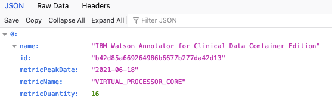

License Service is required for monitoring and measuring license usage of ACD in accord with the pricing rule for IBM containerized software.
License usage is based on a Virtual Processing Core (VPC) metric. For ACD, it is the top-level pod `ibm-wh-acd-acd` that will be metered for VPC usage.
The usage will be the capacity of the node where this pod runs. For example, ACD running in a cluster with 16 CPU/node has license usage = 16 VPC. The ACD CPU limit can be adjusted with the ```spec.resources.limits.cpu```. For more information on configuration see [Configuration](https://ibm.github.io/acd-containers/management/configuring/).

Note: Manual license measurements are not allowed.

## Overview

The integrated licensing solution collects and stores the license usage information which can be used for audit purposes and for tracking license consumption in cloud environments.
The solution works in the background and does not require any configuration.
Only one instance of the License Service is deployed per cluster regardless of the number of Cloud Paks and containerized products that you have installed on the cluster.

To comply with the licensing requirements for IBM containerized software, review [Validating if License Service is deployed on the cluster](#validating-if-license-service-is-deployed-on-the-cluster),
and use the License Service APIs to generate the required usage audit reports (see [License Service](https://www.ibm.com/docs/en/cpfs?topic=operator-overview) documentation).

## Deploying License Service

If [Validating if License Service is deployed on the cluster](#validating-if-license-service-is-deployed-on-the-cluster) determines that the License Service is not deployed on the cluster where you have deployed ACD,
or the License Service does not return a status of Running, refer to the information about License Service, including how to install, retrieve license usage data, and troubleshoot.
See the [License Service](https://github.com/IBM/ibm-licensing-operator/blob/master/docs/License_Service_main.md) documentation.

## Validating if License Service is deployed on the cluster

To ensure license reporting continuity for license compliance purposes, make sure that License Service is successfully deployed.
It is recommended to periodically verify whether it is active.

To validate whether License Service is deployed and running on the cluster, you can, for example, log into the Red Hat OpenShift Container Platform cluster and run the following command:

```bash
oc get pods --all-namespaces | grep ibm-licensing | grep -v operator
```

The following response is a confirmation of successful deployment:

```bash
1/1     Running
```

## Viewing license usage

The license service is accessable via the  that is created as part of the license service setup.

In order to run the report the ```ibm-licensing-token``` secret's token must be retrieved and provided on the above service. Once run, the results will show the .

## Archiving license usage data

Remember to archive the license usage evidence before you decommission the cluster where ACD was deployed. Retrieve the audit snapshot for the period when ACD was on the cluster and store it in case of audit.

For more information about the licensing solution, see [License Service](https://www.ibm.com/docs/en/cpfs?topic=operator-overview) documentation.

For FAQs related to Container licensing, see [Container Licensing FAQs](https://www.ibm.com/software/passportadvantage/containerfaqov.html).
