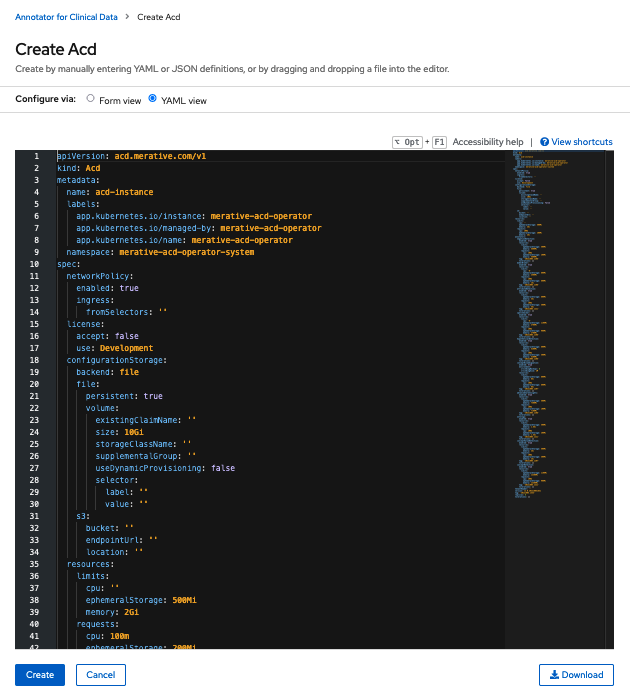
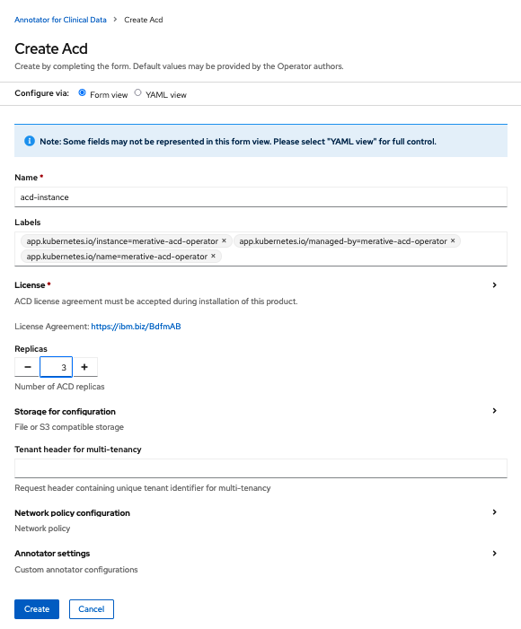

The following tables lists the configurable parameters available for ACD.

If using the web console, these are found under the  or a subset are found under the .

If using the CLI, these are configurable via the CSV.

| Parameter | Description | Default |
| -         | -           | -       |
| `license.accept` | License Accept | `false` |
| `replicas` | ACD replicas | `3`    |
| `annotators.advancedCareInsights.enabled` | Advanced care insights annotator enabled | `true` |
| `annotators.attributeDetection.enabled` | Attribute detection annotator enabled | `true` |
| `annotators.conceptDetection.enabled` | Concept detection annotator enabled | `true` |
| `annotators.conceptDisambiguation.enabled` | Concept disambiguation annotator enabled | `true` |
| `annotators.conceptValueDetection.enabled` | Concept value detection annotator enabled | `true` |
| `annotators.hypotheticalDetection.enabled` | Hypothetical detection annotator enabled | `true` |
| `annotators.modelBroker.enabled` | Model broker annotator enabled | `true` |
| `annotators.negationDetection.enabled` | Negation detection annotator enabled | `true` |
| `annotators.ontology.enabled` | Ontology annotator enabled | `true` |
| `annotators.spellChecker.enabled` | Spell checker annotator enabled | `true` |
| `configurationStorage.backend` | Configuration storage backend (`file` or `cos`) | `file` |
| `configurationStorage.file.persistent` | File based configuration storage persistence enabled | `true` |

These additional configurable parameters may be provided when file based storage (`file`) is used and `configurationStorage.file.persistent` is `true`.

| Parameter | Description | Default |
| -         | -           | -       |
| `configurationStorage.file.volume.existingClaimName` | Use an existing persistent volume claim |  |
| `configurationStorage.file.volume.size` | Persistent volume size, e.g. 10Gi |  |
| `configurationStorage.file.volume.storageClassName` | Use an existing persistent volume of this class type |  |
| `configurationStorage.file.volume.useDynamicProvisioning` | Use a dynamically provisioned volume | `false` |

These additional configurable parameters must be provided when IBM Cloud Object Store (`cos`) is used for  `configurationStorage.backend`.

| Parameter | Description | Default |
| -         | -           | -       |
| `configurationStorage.s3.bucket` | IBM Cloud Object bucket (Required) |  |
| `configurationStorage.s3.endpointUrl` | IBM Cloud Object endpoint (Required) |  |
| `configurationStorage.s3.location` | IBM Cloud Object region (Required) |  |
