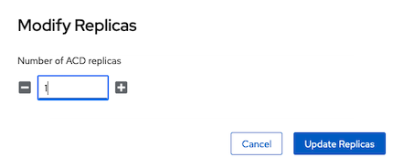

The replica count in the ACD deployment determines the number of replicas for each of the ACD deployments, which determines the peak concurrent capacity of the ACD deployment. If the capacity is exceeded, the system will start to queue up requests to protect the container processes from overload. If the queues fill up, the system will return errors to the caller indicating the system is not available.

To adjust the workload capacity, ACD deployment instances can be horizontally scaled by adjusting the replica count in the `Acd` custom resource instance.

**Note:** Ensure you have enough capacity on the worker nodes in the cluster to support the number of replicas chosen. Each replica consumes approximately 64 GB of memory across all of the deployment pods and there needs to be room for non-disruptive rolling updates.

To update the replica count using the web console, do the following:

1. Log in to the OpenShift Container Platform [web console](https://docs.openshift.com/container-platform/4.7/web_console/web-console.html) using your login credentials.
1. Expand the **Operators** dropdown and select **Installed Operators** to open the Installed Operators page.
1. Expand the **Project** dropdown and select the project for the namespace of the ACD instance.
1. Select the **Annotator for Clinical Data** instance link in the **Provided APIs** column.
1. In the **Operator Details** dashboard, click the **Annotator for Clinical Data** tab.
1. Select **acd-instance** to bring up the Details view of the ACD instance.
1. On the **Replicas** field, click the pencil icon and adjust the number up or down as needed:



To update the replica count using the CLI, do the following:

1. Log in to your Red Hat OpenShift Container Platform as a cluster administrator by using the `oc` CLI.
1. Use the scale command to adjust the number for the `--replicas` parameter up or down as needed. Ensure `${acd_namespace}` is set to the namespace where ACD is installed.

```
oc scale --replicas=1 -n ${acd_namespace} acds.acd.merative.com/acd-instance
```
